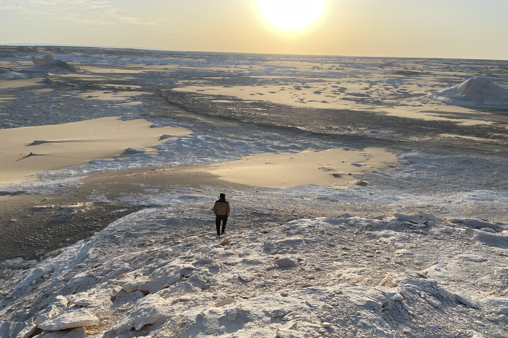
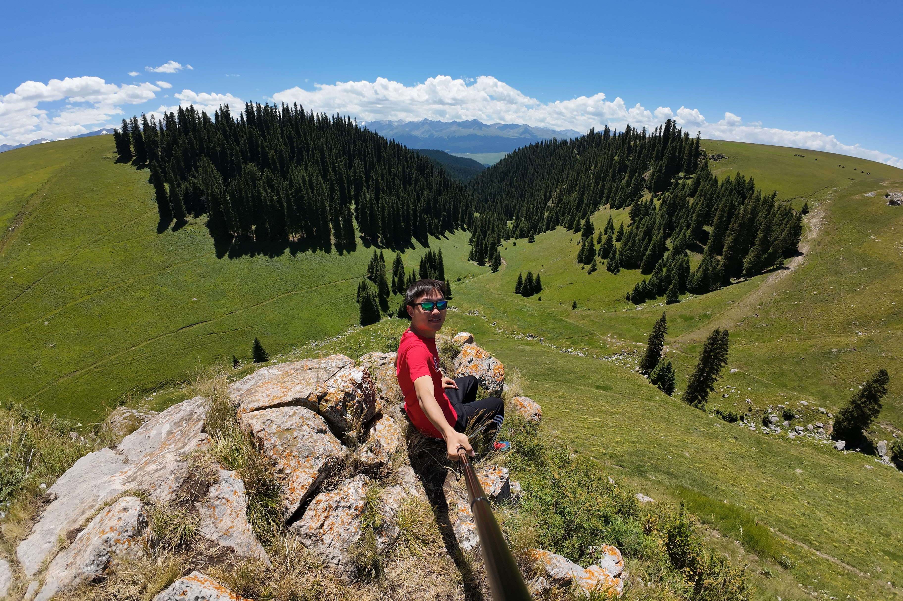
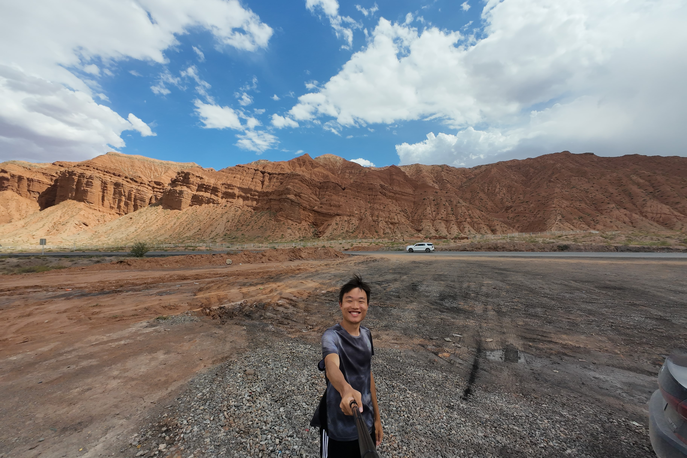
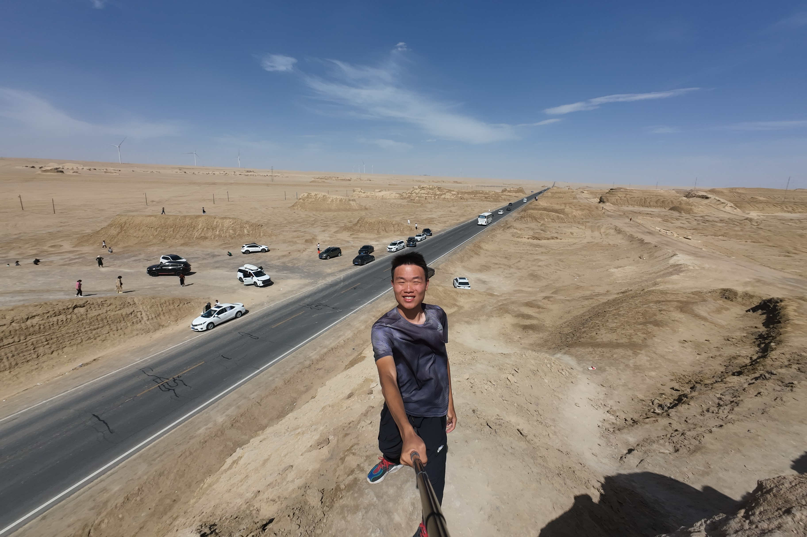
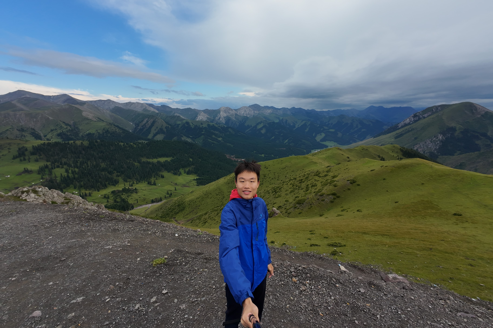
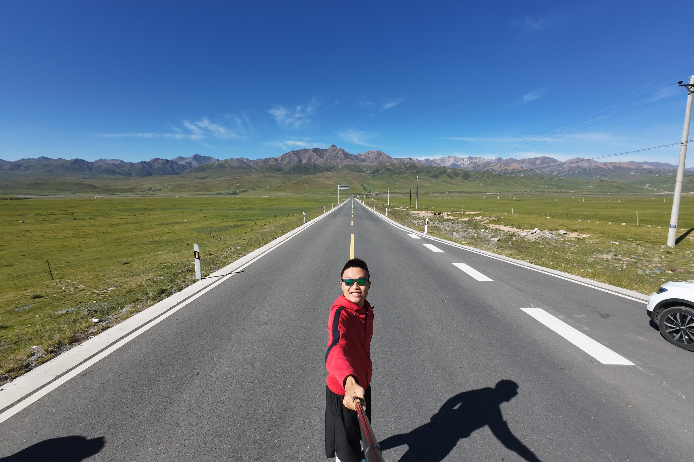
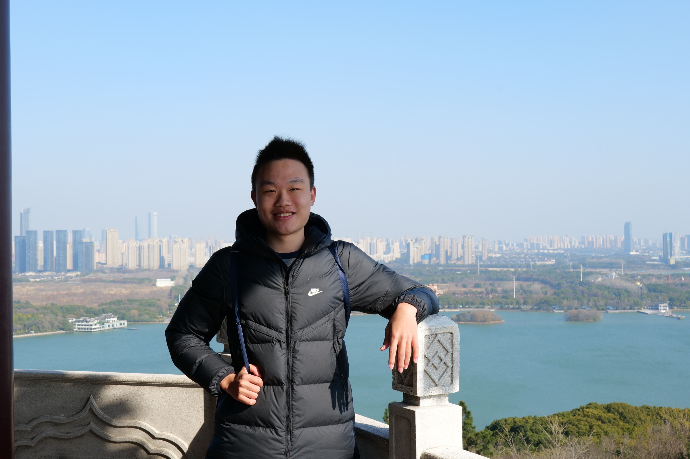
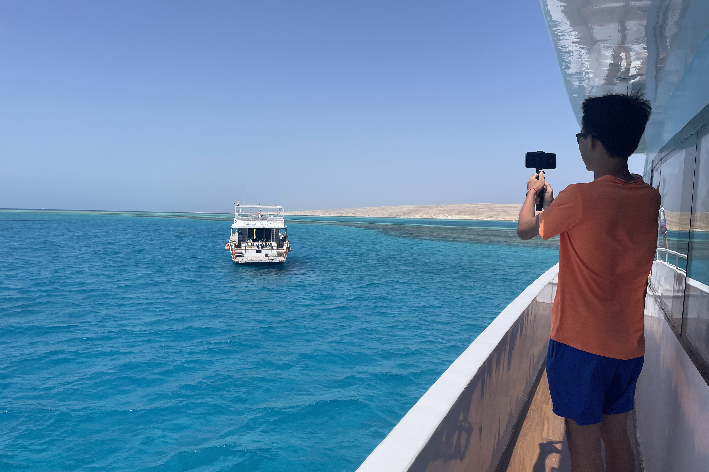
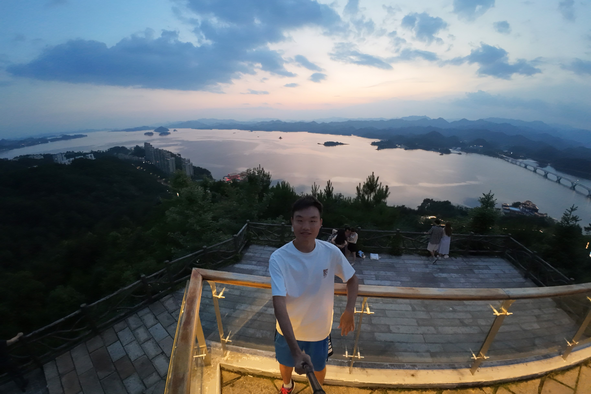
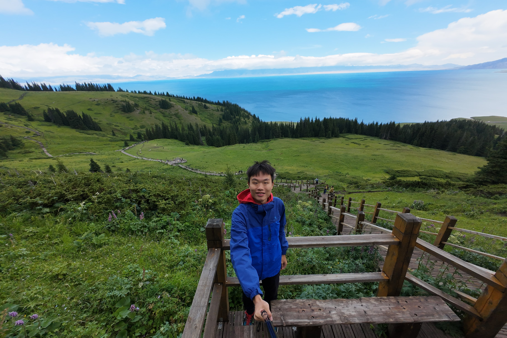

<!-- 放一些杂项 -->

---

# 💾Links

- USTC: [en.ustc.edu.cn](https://en.ustc.edu.cn){:target="_blank"} 
- SGY, USTC: [en.scgy.ustc.edu.cn](https://en.scgy.ustc.edu.cn){:target="_blank"} 
- Math, USTC: [math.ustc.edu.cn](http://math.ustc.edu.cn/ENGLISH/list.htm){:target="_blank"} 
- LibGen: [libgen.gs](https://libgen.gs){:target="_blank"} 
- iCourse Club, USTC: [icourse.club](https://icourse.club){:target="_blank"} 
- Intel OneAPI Toolkits: [OneAPI](https://www.intel.com/content/www/us/en/developer/tools/oneapi/toolkits.html){:target="_blank"} 
- S.-T. Yau College Student Mathematics Contest: [Yau-Contest](http://yau-contest.com/en){:target="_blank"} 
- Warming Math Magazine (USTC Math Department): [Warming](http://staff.ustc.edu.cn/~mathsu01/pu/waming.html){:target="_blank"} 
- AcademicPages (template for this website): [academicpages](https://github.com/academicpages/){:target="_blank"} 
- VSCode portable: [VSCode portable](https://code.visualstudio.com/docs/editor/portable){:target="_blank"} 
- [How to use `ifort` + `IntelMPI`/`coarray` on Windows or Linux clusters](https://blog.csdn.net/PilotJohnWu/article/details/121064266){:target="_blank"} 

# 📷My Homecity

    
    
    
    
     
    
    
    
    
     
    

        my homecity Wuxi, the pearl of Taihu Lake, featuring both modernity and traditional Chinese culture in the Yangtze Delta (photos are taken by myself) 
    

    
 

---

# Explore the world

    
    
    
    
    
    
    
     
    

        deserts, prairies and plateaux
    

    
 

    
    
    
    
    
    
    
    
     
    

        mountains, valleys and glaciers
    

    
 

    
    
    
    
    
    
     
    

        lakes and seas
    

    
 

